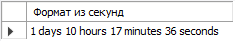
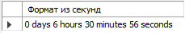
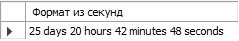

# Урок 6

## **SQL – Транзакции. Временные таблицы, управляющие конструкции, циклы**

### **Основное ДЗ**

- Создайте функцию, которая принимает кол-во сек и формат их в кол-во дней, часов, минут и секунд.  
  *Пример: 123456 ->'1 days 10 hours 17 minutes 36 seconds '*

  

- Выведите только четные числа от 1 до 10 (Через цикл).
  *Пример: 2,4,6,8,10*

---

### **Дополнительное задание: (для ВК: [по ссылке](https://www.notion.so/c448e32ae1344f22b1deae7f42c8b57f))**

- Создать процедуру, которая решает следующую задачу
Выбрать для одного пользователя 5 пользователей в случайной комбинации, которые удовлетворяют хотя бы одному критерию:
    а. из одного города
    б. состоят в одной группе
    в. друзья друзей

---

- Создать функцию, вычисляющей коэффициент популярности пользователя (по количеству друзей).

---

- Создайте хранимую функцию hello(), которая будет возвращать приветствие, в зависимости от текущего времени суток. С 6:00 до 12:00 функция должна возвращать фразу "Доброе утро", с 12:00 до 18:00 функция должна возвращать фразу "Добрый день", с 18:00 до 00:00 — "Добрый вечер", с 00:00 до 6:00 — "Доброй ночи".

---
  
[В начало](#урок-6)